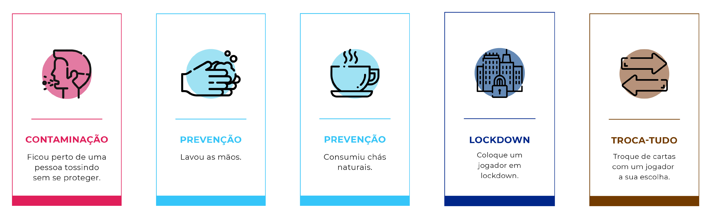

<h1 align="center">

Aplicação de Variantes para Desenvolvimento de Um Jogo Sério Sobre COVID-19: Estudo de Caso Xô Corona

</h1>

Essa oficina propõe-se demonstrar a aplicação de variantes para desenvolvimento de um jogo educacional sobre COVID-19. Para isso, todas os conceitos relacionados serão explicados e detalhes serão dados sobre o desenvolvimento do jogo.

## Conteúdo
### Introdução

### O que são variantes?

### Aplicação de variantes em jogos

### Exploding Kittens e suas variantes

### Jogos sérios

### A criação do Xô Corona

### Experiência ao jogar

Para mais informações sobre o Xô Corona [clique aqui](https://github.com/tekpixo/xo-corona)!
